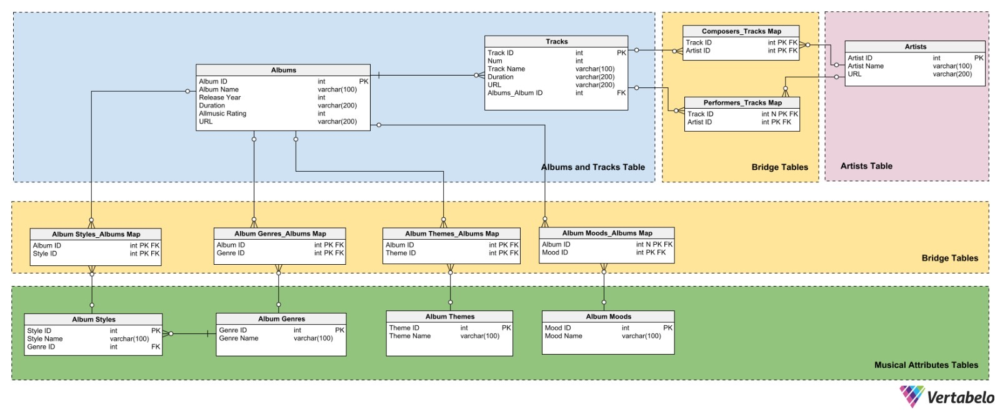

# Code
There are three Juputer notebooks, each notebook does some part of the job:
  * scrape.ipynb: scrape the data from All Music using R
  * wrangling_r.ipynb: wrangle most of the data, using R
  * wrangling_julia.ipynb: wrangle most of the data, using Julia

To reproduce the entire process, you can first delete the "original" and "wrangled" folder or change the `original_path` and `wrangled_path` variable in three Jupyter Notebooks.  
1. Run the entire "scrape.ipynb" will scrape the desired data, you can choose variable `year` and `page` in the last code block to manipulate the scrape process, you can see more details in the notebook. Be patient since it will take a while, but you can stop the scraping if you want to, it won't affect the wrangling part as long as as you've got some of the data.
2. Run the entire "wrangling_r.ipynb" and "wrangling_julia.ipynb" to wrangle the data, the order of execution of these two files does not matter.

# Data
The original data scraped from AllMusic is stored in the "original" folder and the wrangled data are stored in the "wrangled" folder, these are by default, you can change the path if you like.

## Original data
For the original data, it will be stored as the structure shown below:
```
.
├── original
    ├── genre.csv
    ├── mood.csv
    ├── style.csv
    ├── theme.csv
    ├── 2022
    │   ├── 1
    │   │   ├── albums.csv
    │   │   └── tracks.csv
    │   ├── 2
    │   │   ├── albums.csv
    │   │   └── tracks.csv
    │   ├── ...
    ├── 2023
    │   ├── ...
    ├── ...
```
"genre", "style", "mood" and "theme" are stored seperately, each csv file contains all the data of these four attributes.  

"albums" and "tracks" are splited by release year and page number. The reason is that we should save the data we scraped ASAP, so here we save the data locally after scraping every page.

### `genre`
* `id`: the id of the genre;  
* `genre`: the name of the genre;  

### `style`
* `id`: the id of the style;  
* `style`: the name of the style;  
* `genre_id`: styles are extensions of genres, it's the column indicates which genre a style belongs to;  

### `mood`
* `id`: the id of the mood;  
* `mood`: the name of the mood;  

### `theme`
* `id`: the id of the theme;  
* `theme`: the name of the theme;  

### `albums`
* `album`: the title of the album;  
* `duration`: the duration of the album;  
* `release_date`: the release date of the album;  
* `all_music_rating`: the rating released by All Music, it's a integer * bewteen [0, 10];  
* `recording_data`: the recording date of the album, it's actually a * string, which may be a period of time;  
* `recording_location`: the recording location of the album, it's a * string, if there are more than one recording locations, locations will * be seperated by `;`;  
* `genre_names`: the genres' names of the album. It's a string, if there * are more than one genres, genres' names will be seperated by `;`;  
* `genre_urls`: the genres' urls of the album. It's a string, if there are * more than one genres, genres' urls will be seperated by `;`;  
* `style_names`: the styles' names of the album. It's a string, if there * are more than one styles, styles' names will be seperated by `;`;  
* `style_urls`: the styles' urls of the album. It's a string, if there are * more than one styles, styles' urls will be seperated by `;`;  
* `mood_names`: the moods' names of the album. It's a string, if there are * more than one moods, moods' names will be seperated by `;`;  
* `mood_urls`: the moods' urls of the album. It's a string, if there are * more than one moods, moods' urls will be seperated by `;`;  
* `theme_names`: the themes' names of the album. It's a string, if there * are more than one themes, themes' names will be seperated by `;`;  
* `theme_urls`: the themes' urls of the album. It's a string, if there are * more than one themes, themes' urls will be seperated by `;`;  
* `url`: the url of the album;  

### `tracks`
* `num`: the number of the track in an album;  
* `title`: the title of the track;  
* `duration`: the duration of the track;  
* `url`: the url of the track;  
* `composer_urls`: the composers' urls of the track. It's a string, if there are * more than one composers, composers' urls will be seperated by `;`;  
* `composer_names`: the composers' names of the track. It's a string, if there * are more than one composers, composers' names will be seperated by `;`;  
* `performer_urls`: the performers' urls of the track. It's a string, if there * are more than one performers, performers' urls will be seperated by `;`;  
* `performer_names`: the performers' names of the track. It's a string, if there * are more than one performers, performers' names will be seperated by `;`;  
* `album_url`: the url of the album that this track belongs to;  

## Wrangled data
For the wrangled data, it will be stored as the structure shown below:
```
.
├── wrangled
    ├── albums.csv
    ├── artists.csv
    ├── composers_tracks_map.csv
    ├── genre.csv
    ├── genre_albums_map.csv
    ├── mood.csv
    ├── mood_albums_map.csv
    ├── performers_tracks_map.csv
    ├── style.csv
    ├── style_albums_map.csv
    ├── theme.csv
    ├── theme_albums_map.csv
    └── tracks.csv
```

### `grenre`, `style`, `mood`, `theme`
they are the same as in the original data.

### `albums`
* `album_id`: the id of teh album;
* `album_name`: the title of the album;  
* `duration`: the duration of the album;  
* `release_date`: the release date of the album;  
* `all_music_rating`: the rating released by All Music, it's a integer * bewteen [0, 10];  
* `url`: the url of the album page;  

### `tracks`
* `track_id`: the id of the track;
* `num`: the number of the track in an album;  
* `track_title`: the title of the track;  
* `duration`: the duration of the track;  
* `album_id`: the ablum's album_id that the the track belongs to;
* `url`: the url of the track page;  

### `artists`
`artist` is a combination of composers and performers; 
* `artist_id`: the id of the artist;
* `artist_name`: the name of the artist.
* `url`: the url of the artist page;  

### `genre_albums_map`
Genres and albums are M:N relation, so this is the relation table between genres and albums;
* `album_id`: id of the album;
* `genre_id`: id of the genre;

### `style_albums_map`
Styles and albums are M:N relation, so this is the relation table between styles and albums;
* `album_id`: id of the album;
* `style_id`: id of the style;

### `mood_albums_map`
Moods and albums are M:N relation, so this is the relation table between moods and albums;
* `album_id`: id of the album;
* `mood_id`: id of the mood;

### `theme_albums_map`
Themes and albums are M:N relation, so this is the relation table between themes and albums;
* `album_id`: id of the album;
* `theme_id`: id of the theme;

### `composers_tracks_map`
Composers and tracks are M:N relation, so this is the relation table between composers and tracks;
* `composer_id`: id of the composer;
* `track_id`: id of the track;

### `performers_tracks_map`
Performers and tracks are M:N relation, so this is the relation table between performers and tracks;
* `performer_id`: id of the performer;
* `track_id`: id of the track;
